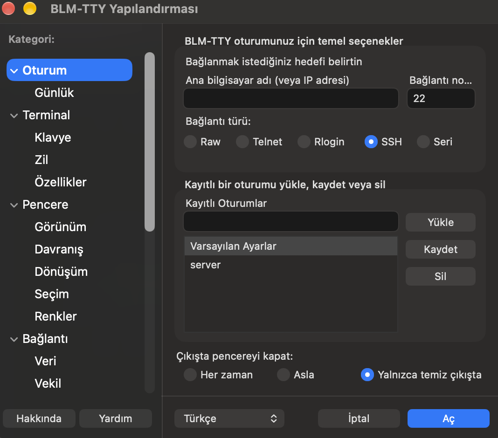
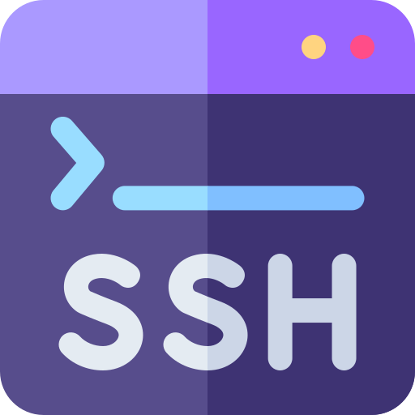

# BLM-TTY



<p align="center">
  
</p>

<p align="center">
  <strong>A native macOS PuTTY-style terminal client</strong><br>
  Swift · AppKit · SSH / Telnet / Rlogin / Serial / Raw
</p>

<p align="center">
  <a href="#english">English</a> ·
  <a href="#türkçe">Türkçe</a>
</p>

<p align="center">
  
  
  
  
</p>

---

## English

Native macOS client with PuTTY’s session model: saved sessions, protocol options, and a console login instead of a password dialog.

**Version** 1.0.0 · **Bundle ID** `com.blmtty.app`

### What it is (and is not)

| | |
|---|---|
| **Is** | AppKit configuration window (PuTTY category tree + saved-session list) and a native terminal window |
| **SSH** | System `/usr/bin/ssh` on a Darwin PTY (`forkpty`). Username and password are typed in the console |
| **Is not** | A Win32 look-alike, an Xcode project, or a from-scratch SSH-2 stack |

No macOS password sheet for normal SSH. Flow: TCP connect → `Connecting to host port …` → `login as:` if the username is empty → OpenSSH `password:` in the same console.

This is **not** a fork of PuTTY and does **not** include PuTTY source.

### Features

- **Protocols:** SSH, Telnet, Rlogin, Raw, Serial
- **Saved sessions:** load / save / delete, Default Settings. Select a saved session and **Connect** (or double-click) to open it immediately
- **Language:** English / Türkçe, live switch
- **Terminal:** VT/xterm emulator, selection, Cmd+C / Cmd+V
- **Scrollback:** mouse wheel, scrollbar, PgUp / PgDn, Shift+Home / Shift+End. New output does not yank you out of history
- **Chrome:** Terminal.app-like 6 pt inset; last cell is not stretched into the rounded corners
- **Right-click paste** in the console (PuTTY-style). Empty clipboard does nothing; the app does not crash
- **Title bar:** right-click for New Session, Duplicate Session, Restart Session
- **Close:** while connected, *Do you want to end the connection?* Closing the last terminal **quits the app**
- **Keys:** PuTTY PPK2/PPK3 (`.ppk`), OpenSSH private keys, `SSH_AUTH_SOCK` agent
- **Tools:** PuTTYgen window, event log
- **CLI:** PuTTY-like flags (`-ssh`, `-P`, `-l`, `-i`, `-load`, …)

### What’s new

Shipped in the current `dist/` binary (v1.0.0):

| | English |
|---|---|
| **Connect** | Bottom button is **Connect** (was Open). Turkish: **Bağlan** |
| **Saved session** | Selecting a saved session loads it into the form. **Connect** or a double-click opens that session immediately. Load / Save / Delete still work |
| **Title bar menu** | Right-click (or Control-click) the terminal title (`host - BLM-TTY`) for New Session, Duplicate Session, Restart Session. Console right-click still pastes |
| **Scrollback** | Wheel, legacy scrollbar, PgUp / PgDn. Shift+Home / Shift+End jump to oldest / newest. Default: do not jump to bottom on new output |
| **Insets** | Native Terminal.app-style padding around the grid |
| **Icon** | Built every time from [`Sources/logo.png`](Sources/logo.png) |
| **Sign** | Apple Development identity from the Xcode account (Keychain) |

### Requirements

- macOS 13.0 or later
- [Xcode Command Line Tools](https://developer.apple.com/xcode/resources/) (`swiftc`, `codesign`, `sips`, `iconutil`)
- Swift 5.9+
- System OpenSSH (`/usr/bin/ssh`) — Apple OpenSSH 9/10

There is no `.xcodeproj`. Build with the script below. `Package.swift` is a skeleton; packaging is done by `build_and_run.sh`.

### Download

A pre-built app is in this repository (Apple Silicon / `arm64`, macOS 13+):

- [`dist/BLM-TTY.app`](dist/BLM-TTY.app) — after clone: `open dist/BLM-TTY.app`
- [`dist/BLM-TTY-macos.zip`](dist/BLM-TTY-macos.zip) — zip of the same bundle

Signed with the **Apple Development** certificate from the Xcode account (Keychain), not ad-hoc. Another Mac may still Gatekeeper-block it until Finder → right-click → **Open**. Intel Macs: build from source. Corresponding source is this repository (GPL-3).

### Build

```bash
git clone https://github.com/kaderkarakus/BLM-TTY.git
cd BLM-TTY
chmod +x build_and_run.sh
./build_and_run.sh
```

The script compiles `Sources/**/*.swift`, `*.c` and `*.m`, converts `Sources/logo.png` → `AppIcon.icns`, writes `BLM-TTY.app`, codesigns, and opens the app.

Signing uses the Xcode account’s **Apple Development** identity in the Keychain. Set `CODESIGN_IDENTITY` only to override. Ad-hoc is not the default:

```bash
./build_and_run.sh

# Override (optional)
export CODESIGN_IDENTITY="Apple Development: Your Name (TEAMID)"
./build_and_run.sh

# Ad-hoc only if you mean it
CODESIGN_IDENTITY="-" ./build_and_run.sh
```

No identity in Keychain → the script exits. Add the account in Xcode → Settings → Accounts.

The local `./BLM-TTY.app` (build output at repo root) is gitignored. The release copy under `dist/` is committed.

### Usage

1. Enter a host (or pick a saved session) and click **Connect**. Selecting a saved session loads it; **Connect** or a double-click opens that session immediately.
2. If the username is empty, type it at `login as:` and press Enter.
3. Type the password at the server’s `password:` prompt.

If the session already has a username, `login as:` is skipped.

Paste with **right-click** in the console or **Cmd+V**. Line breaks are sent as Enter. Right-click the **title bar** (not the console) for New Session / Duplicate Session / Restart Session.

Scroll older output with the mouse wheel, the scrollbar, or **PgUp** / **PgDn**. **Shift+Home** / **Shift+End** jump to the oldest / newest lines.

The red close button on the last terminal **quits** BLM-TTY; it does not return to the config window. Reopening from the Dock shows configuration. **File → New Session** (or title-bar New Session) opens another config window.

### Session files

```
~/Library/Application Support/BLM-TTY/sessions/
~/Library/Application Support/BLM-TTY/sshhostkeys
~/Library/Application Support/BLM-TTY/openssh_known_hosts
```

Format: PuTTY Unix session (`key=value`). On first launch, `~/.putty/sessions/` is imported if present. Windows `.reg` import/export is also read.

### Keys

- PuTTY **PPK2 / PPK3** (`.ppk`) — Tools → PuTTYgen; converted to a temporary OpenSSH identity for SSH
- OpenSSH private key (`-i` / Auth panel)
- Agent: `SSH_AUTH_SOCK`

Askpass is used **only** with CLI `-pw`. Interactive SSH passwords stay in the console.

### Command line

```text
BLM-TTY.app/Contents/MacOS/BLM-TTY [options] [user@]host
```

| Flag | Meaning |
|---|---|
| `-ssh` `-telnet` `-rlogin` `-raw` `-serial` | protocol |
| `-P port` | port |
| `-l user` | username |
| `-pw password` | password (askpass, not the console) |
| `-i key.ppk` | identity file |
| `-L` `-R` `-D` | tunnels |
| `-X` | X11 |
| `-A` / `-a` | agent forward on / off |
| `-C` | compression |
| `-load "Session"` | saved session |
| `-log file` | session log |
| `-h` `--help` | help |

If a host is given, configuration is skipped and the session opens immediately.

### Architecture (short)

| Piece | Implementation |
|---|---|
| UI | AppKit. Config: native window + PuTTY category tree. Terminal: `NSWindow` with 6 pt inset and optional scrollbar |
| SSH | `/usr/bin/ssh` + C `forkpty` (`Sources/Net/pty_spawn.c`) |
| Telnet / Rlogin / Raw | `Network.framework` TCP |
| Serial | termios |
| Emulator | custom VT/xterm (`TerminalEmulator`), 2000-line scrollback |
| i18n | `L10nStrings.swift` EN + TR |

Longer (partly historical) spec: [`ARCHITECTURE.md`](ARCHITECTURE.md). The Win32 chrome and native SSH-2 stack described there were **not** shipped. SSH is system OpenSSH.

Apple OpenSSH does **not** accept `GSSAPIKeyExchange`. GSSAPI uses only `GSSAPIAuthentication` / `GSSAPIDelegateCredentials`.

### License

[GNU General Public License v3.0](LICENSE) or later. See [`LICENSE`](LICENSE).

No warranty. Original application code. PuTTY source is not copied. Session files, Conf semantics, and PPK layouts follow publicly documented formats. [PuTTY](https://www.chiark.greenend.org.uk/~sgtatham/putty/) is MIT-licensed; this project is not affiliated with the PuTTY authors.

---

## Türkçe

PuTTY oturum modelinin native macOS karşılığı: kayıtlı oturumlar, protokol seçenekleri ve şifre penceresi yerine konsol girişi.

**Sürüm** 1.0.0 · **Bundle ID** `com.blmtty.app`

### Ne yapar, ne yapmaz

| | |
|---|---|
| **Yapar** | AppKit yapılandırma penceresi (PuTTY kategori ağacı + kayıtlı oturum listesi) ve native terminal |
| **SSH** | Sistem `/usr/bin/ssh`, Darwin PTY (`forkpty`). Kullanıcı adı ve parola konsola yazılır |
| **Yapmaz** | Win32 kopyası, Xcode projesi veya sıfırdan SSH-2 yığını |

Normal SSH için macOS parola kutusu yok. Akış: TCP bağlan → `Connecting to host port …` → kullanıcı adı boşsa `login as:` → aynı konsolda OpenSSH `password:`.

Bu proje **PuTTY fork’u değildir** ve PuTTY kaynağını **içermez**.

### Özellikler

- **Protokoller:** SSH, Telnet, Rlogin, Raw, Serial
- **Oturumlar:** yükle / kaydet / sil, Default Settings. Kayıtlı oturumu seçip **Bağlan** (veya çift tık) hemen açar
- **Dil:** English / Türkçe, anında
- **Terminal:** VT/xterm öykünücü, seçim, Cmd+C / Cmd+V
- **Kaydırma:** tekerlek, kaydırma çubuğu, PgUp / PgDn, Shift+Home / Shift+End. Yeni çıktı geçmiş görünümünü bozmaz
- **Kenar:** Terminal.app benzeri 6 pt boşluk; son hücre köşeye gerilmez
- **Sağ tıkla yapıştır** konsolda (PuTTY). Pano boşsa hiçbir şey olmaz; uygulama kırılmaz
- **Başlık çubuğu:** sağ tık → Yeni Oturum, Oturumu Çoğalt, Oturumu Yeniden Başlat
- **Kapatma:** bağlıyken *Bağlantıyı sonlandırmak istiyor musunuz?* Son terminal kapanınca **uygulama çıkar**
- **Anahtar:** PuTTY PPK2/PPK3 (`.ppk`), OpenSSH özel anahtar, `SSH_AUTH_SOCK` ajan
- **Araçlar:** PuTTYgen penceresi, event log
- **CLI:** PuTTY’ye yakın bayraklar (`-ssh`, `-P`, `-l`, `-i`, `-load`, …)

### Yenilikler

Güncel `dist/` ikili (v1.0.0):

| | Türkçe |
|---|---|
| **Bağlan** | Alt düğme **Bağlan** (eski adı Aç). İngilizce: **Connect** |
| **Kayıtlı oturum** | Seçmek formu doldurur. **Bağlan** veya çift tık o oturumu hemen açar. Yükle / Kaydet / Sil duruyor |
| **Başlık menüsü** | Terminal başlığına (`host - BLM-TTY`) sağ tık (veya Control-tık): Yeni Oturum, Oturumu Çoğalt, Oturumu Yeniden Başlat. Konsol sağ tık hâlâ yapıştırır |
| **Kaydırma** | Tekerlek, kaydırma çubuğu, PgUp / PgDn. Shift+Home / Shift+End en eski / en yeni. Varsayılan: yeni çıktıda alta zıplama |
| **Kenar boşluğu** | Native Terminal.app tarzı padding |
| **İkon** | Her derlemede [`Sources/logo.png`](Sources/logo.png) |
| **İmza** | Xcode hesabının Keychain’deki Apple Development kimliği |

### Gereksinimler

- macOS 13.0+
- [Xcode Command Line Tools](https://developer.apple.com/xcode/resources/) (`swiftc`, `codesign`, `sips`, `iconutil`)
- Swift 5.9+
- Sistem OpenSSH (`/usr/bin/ssh`) — Apple OpenSSH 9/10

`.xcodeproj` yok. Derleme aşağıdaki script ile. `Package.swift` iskelettir; paketlemeyi `build_and_run.sh` yapar.

### İndirme

Derlenmiş uygulama bu depoda (Apple Silicon / `arm64`, macOS 13+):

- [`dist/BLM-TTY.app`](dist/BLM-TTY.app) — klon sonrası: `open dist/BLM-TTY.app`
- [`dist/BLM-TTY-macos.zip`](dist/BLM-TTY-macos.zip) — aynı paketin zip’i

Xcode hesabındaki **Apple Development** sertifikasıyla imzalı (ad-hoc değil). Başka Mac’te Gatekeeper kesebilir: Finder → sağ tık → **Aç**. Intel Mac: kaynaktan derle. Kaynak bu depodur (GPL-3).

### Derleme

```bash
git clone https://github.com/kaderkarakus/BLM-TTY.git
cd BLM-TTY
chmod +x build_and_run.sh
./build_and_run.sh
```

Script `Sources/**/*.swift`, `*.c` ve `*.m` derler, `Sources/logo.png` → `AppIcon.icns` üretir, `BLM-TTY.app` yazar, imzalar ve açar.

İmza, Xcode hesabının Keychain’deki **Apple Development** kimliğidir. `CODESIGN_IDENTITY` yalnızca geçersiz kılmak için. Ad-hoc varsayılan değil:

```bash
./build_and_run.sh

# İsteğe bağlı geçersiz kılma
export CODESIGN_IDENTITY="Apple Development: Ad Soyad (TEAMID)"
./build_and_run.sh

# Ad-hoc yalnızca bilinçli
CODESIGN_IDENTITY="-" ./build_and_run.sh
```

Keychain’de kimlik yoksa script çıkar. Hesap: Xcode → Settings → Accounts.

Kökteki yerel `./BLM-TTY.app` gitignore’da. Yayımlanan kopya `dist/` altında commit edilir.

### Kullanım

1. Host gir (veya kayıtlı oturum seç), **Bağlan**. Kayıtlı oturumu seçmek formu doldurur; **Bağlan** veya çift tık o oturumu hemen açar.
2. Kullanıcı adı boşsa konsolda `login as:` yaz, Enter.
3. Sunucunun `password:` satırına parolayı yaz.

Oturumda kullanıcı adı doluysa `login as:` atlanır.

Yapıştırma: konsolda **sağ tık** veya **Cmd+V**. Satır sonları Enter olarak gider. **Başlık çubuğuna** sağ tık (konsola değil): Yeni Oturum / Oturumu Çoğalt / Oturumu Yeniden Başlat.

Eski çıktı: tekerlek, kaydırma çubuğu veya **PgUp** / **PgDn**. **Shift+Home** / **Shift+End** en eski / en yeni satıra gider.

Son terminalin kırmızı kapat düğmesi uygulamayı **kapatır**; yapılandırmaya dönmez. Dock’tan yeniden açılırsa yapılandırma gelir. **File → New Session** (veya başlıktan Yeni Oturum) yeni bir yapılandırma penceresi açar.

### Oturum dosyaları

```
~/Library/Application Support/BLM-TTY/sessions/
~/Library/Application Support/BLM-TTY/sshhostkeys
~/Library/Application Support/BLM-TTY/openssh_known_hosts
```

Biçim: PuTTY Unix oturumu (`anahtar=değer`). İlk açılışta varsa `~/.putty/sessions/` içe aktarılır. Windows `.reg` import/export da okunur.

### Anahtarlar

- PuTTY **PPK2 / PPK3** (`.ppk`) — Tools → PuTTYgen; SSH için geçici OpenSSH kimliğine çevrilir
- OpenSSH özel anahtar (`-i` / Auth paneli)
- Ajan: `SSH_AUTH_SOCK`

Askpass **yalnızca** CLI `-pw` ile. İnteraktif SSH parolası konsoldadır.

### Komut satırı

```text
BLM-TTY.app/Contents/MacOS/BLM-TTY [seçenekler] [user@]host
```

| Bayrak | Anlam |
|---|---|
| `-ssh` `-telnet` `-rlogin` `-raw` `-serial` | protokol |
| `-P port` | port |
| `-l user` | kullanıcı |
| `-pw password` | parola (askpass; konsol değil) |
| `-i key.ppk` | kimlik dosyası |
| `-L` `-R` `-D` | tünel |
| `-X` | X11 |
| `-A` / `-a` | ajan ilet / kapat |
| `-C` | sıkıştırma |
| `-load "Oturum"` | kayıtlı oturum |
| `-log dosya` | oturum günlüğü |
| `-h` `--help` | yardım |

Host verilirse yapılandırma atlanır, doğrudan bağlanır.

### Mimari (kısa)

| Parça | Uygulama |
|---|---|
| UI | AppKit. Yapılandırma: native pencere + PuTTY kategori ağacı. Terminal: `NSWindow`, 6 pt kenar, isteğe bağlı kaydırma çubuğu |
| SSH | `/usr/bin/ssh` + C `forkpty` (`Sources/Net/pty_spawn.c`) |
| Telnet / Rlogin / Raw | `Network.framework` TCP |
| Serial | termios |
| Emülatör | özgün VT/xterm (`TerminalEmulator`), 2000 satır scrollback |
| i18n | `L10nStrings.swift` EN + TR |

Daha uzun (kısmen tarihî) spesifikasyon: [`ARCHITECTURE.md`](ARCHITECTURE.md). Oradaki Win32 krom ve native SSH-2 yığını **yayımlanmadı**. SSH sistem OpenSSH’dir.

Apple OpenSSH `GSSAPIKeyExchange` kabul etmez. GSSAPI yalnızca `GSSAPIAuthentication` / `GSSAPIDelegateCredentials`.

### Lisans

[GNU Genel Kamu Lisansı v3.0](LICENSE) veya sonrası. Metin: [`LICENSE`](LICENSE).

Garanti yok. Uygulama kodu bu proje için yazılmıştır. PuTTY kaynağı kopyalanmaz. Oturum dosyası, Conf semantiği ve PPK biçimleri belgelenmiş kamu formatlarına göredir. [PuTTY](https://www.chiark.greenend.org.uk/~sgtatham/putty/) MIT lisanslıdır; bu proje PuTTY yazarlarıyla bağlı değildir.
